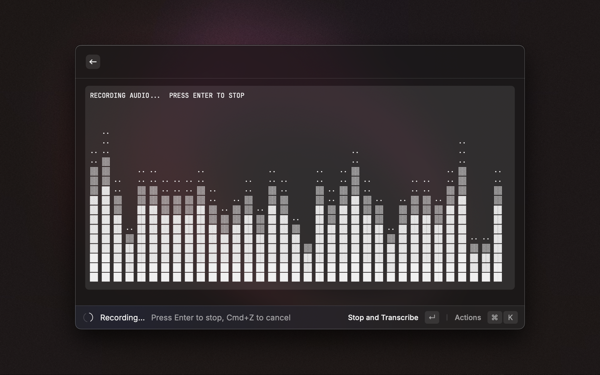

# ElevenlabsWhisper

A Raycast extension that provides speech-to-text transcription using ElevenLabs' Scribe model.

<div align="center">
  
  
</div>

## Features

### 🎙️ Audio Recording
- **Audio capture** using SoX (Sound eXchange) command-line tool
- **Live waveform visualization** with animated ASCII art during recording
- **High-quality audio**: 16kHz sample rate, 16-bit, mono WAV format
- **Smart process management**: Handles SoX process spawning and graceful termination
- **Automatic file cleanup**: Removes temporary files after transcription

### 🤖 AI Transcription
- **ElevenLabs Scribe integration**: Optimized specifically for ElevenLabs' Scribe model
- **High accuracy**: Leverages ElevenLabs' advanced speech-to-text technology
- **Direct clipboard integration**: Seamlessly copy transcribed text
- **Transcript editing**: Edit text before copying/pasting
- **Comprehensive error handling**: Robust error recovery and user feedback

### 🎯 User Experience
- **Simple workflow**: Automatic recording start when extension opens
- **Intuitive controls**: Enter to stop recording, Esc to cancel
- **Visual feedback**: Clear state indicators and progress animations
- **Session management**: Fresh state for each recording session

## Get Started

### Prerequisites

- **macOS**: Required for SoX audio capture
- **Node.js**: For development (v16+ recommended)
- **SoX**: Install via Homebrew
  ```bash
  brew install sox
  ```

### Installation

1. **Clone the repository**
   ```bash
   git clone https://github.com/insv23/elevenlabswhisper.git
   cd elevenlabswhisper
   ```

2. **Install dependencies**
   ```bash
   npm install
   ```

3. **Configure API keys**
   - Get API keys from your preferred provider:
     - [ElevenLabs](https://elevenlabs.io/)
     - [302.ai](https://302.ai/)
   - Configure in Raycast extension preferences

4. **Run in development**
   ```bash
   npm run dev
   ```

5. **Build for production**
   ```bash
   npm run build
   ```

### Usage

1. **Open Raycast** and search for "ElevenlabsWhisper"
2. **Configure preferences** (first time only):
   - Select provider (ElevenLabs or 302.ai)
   - Enter API key
   - Configure optional settings
3. **Start recording**: Extension automatically begins recording when opened
4. **Stop recording**: Press Enter to stop and start transcription
5. **Review transcript**: Edit if needed before copying
6. **Copy to clipboard**: Use the paste button to insert text

### Keyboard Shortcuts

- **Enter**: Stop recording and start transcription
- **Cmd+N**: Start new recording (from transcript view)
- **Esc**: Cancel recording

## Project Structure

```
elevenlabswhisper/
├── src/
│   ├── transcribe.tsx              # Main UI component
│   ├── hooks/
│   │   └── useTranscription.ts     # Transcription workflow logic
│   ├── services/
│   │   ├── audio.service.ts        # SoX audio recording management
│   │   ├── transcription.service.ts # API transcription services
│   │   └── storage.service.ts      # File system operations
│   ├── types/
│   │   ├── index.ts                # Type exports
│   │   └── preferences.ts          # Preference definitions
│   └── utils/
│       ├── index.ts                # Utility exports
│       └── waveform.ts             # ASCII waveform generation
├── docs/
│   └── bugs/                       # Bug documentation
├── package.json                    # Project dependencies and scripts
├── tsconfig.json                   # TypeScript configuration
└── CHANGELOG.md                    # Version history
```

### Architecture Overview

**Layered Architecture**:
1. **UI Layer** (`transcribe.tsx`): Pure presentation and user interaction
2. **Business Logic Layer** (`useTranscription.ts`): State management and workflow
3. **Service Layer** (`services/`): Infrastructure and external system integration
4. **Utility Layer** (`utils/`): Reusable helper functions

**Key Components**:
- **Audio Service**: Manages SoX process lifecycle with robust cleanup
- **Transcription Service**: Handles API communication with providers
- **Storage Service**: File operations and cleanup
- **Waveform Utility**: Real-time audio visualization

## Configuration

### Audio Settings
- **SoX Executable Path**: Custom SoX binary location (optional)
- **Auto-detection**: Checks common Homebrew installations and PATH

### Provider Configuration
- **Provider Selection**: ElevenLabs or 302.ai
- **Model ID**: Customizable transcription model (default: scribe_v1)
- **API Keys**: Secure authentication for selected provider

## Development

### Scripts
- `npm run dev`: Start development server
- `npm run build`: Build for production
- `npm run lint`: Run ESLint
- `npm run type-check`: Run TypeScript type checking

### Technologies Used
- **Raycast API**: Extension framework and UI components
- **TypeScript**: Type-safe development
- **React**: Component-based UI
- **SoX**: Audio processing and recording
- **Node.js**: Runtime environment

## Troubleshooting

### Common Issues

1. **SoX not found**: Ensure SoX is installed and available on PATH
2. **API key errors**: Verify API keys are correctly configured
3. **Recording issues**: Check microphone permissions in macOS settings
4. **Process cleanup**: Extension automatically handles SoX process termination

### Debug Mode
Enable debug logging by setting environment variables or checking Raycast's developer console for detailed error information.

## Contributing

1. Fork the repository
2. Create a feature branch
3. Make your changes
4. Run tests and linting
5. Submit a pull request

## License

This project is open source and available under the MIT License.
